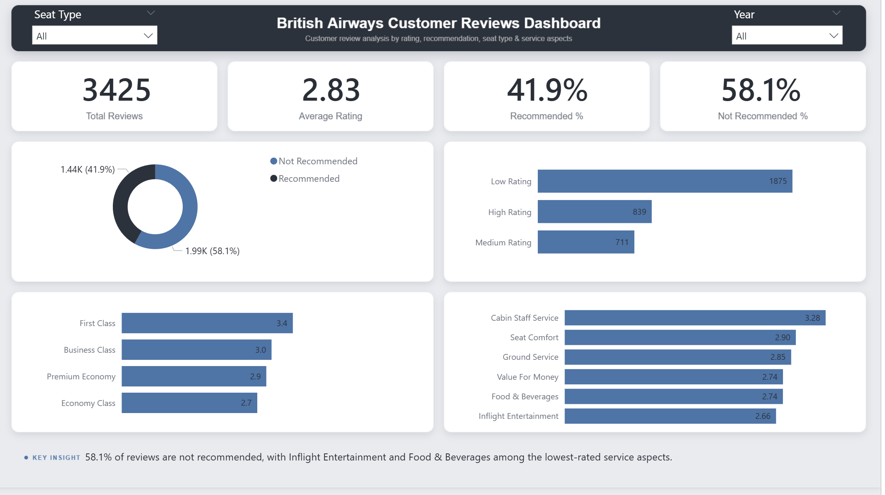

# British Airways Customer Reviews Analysis

This project analyzes British Airways customer reviews using Python and Power BI.

The analysis includes data cleaning, feature engineering, basic text analysis, and a Power BI dashboard.

## Dashboard Preview



## Project Overview

The goal of this project is to understand customer satisfaction based on:

- Recommendation status
- Average rating
- Seat type
- Service rating aspects
- Review text patterns

## Dataset

The dataset contains two files:

- `reviews_data1.csv`
- `rating_data.csv`

The two files were merged after checking that the row count was equal and that the `Recommended` column matched between both files.

## Tools Used

- Python
- Pandas
- Power BI
- GitHub

## Main Cleaning Steps

- Merged the review data with the rating data
- Removed duplicate rows
- Removed columns with very high missing values
- Converted invalid `0` ratings into missing values
- Filled selected missing categorical values with `Unknown`
- Cleaned review text spacing
- Converted `Date Flown` into a proper date column
- Created Year and Month columns

## Feature Engineering

New columns created during the analysis:

- `Clean_Review`
- `Word_Count`
- `Review_Length`
- `Average_Rating`
- `Recommendation_Status`
- `Verification_Status`
- `Rating_Level`
- `Date_Flown_Clean`
- `Year`
- `Month`
- `Month_Name`

## Key Insights

- Total cleaned reviews: **3,425**
- Average rating: **2.83 out of 5**
- **58.1%** of reviews are not recommended
- **41.9%** of reviews are recommended
- Low rating reviews are the largest rating group
- First Class has the highest average rating among seat types
- Cabin Staff Service is the highest-rated service aspect
- Inflight Entertainment is the lowest-rated service aspect

## Power BI Dashboard

The dashboard includes:

- Total Reviews
- Average Rating
- Recommended %
- Not Recommended %
- Recommendation Status Distribution
- Rating Level Distribution
- Average Rating by Seat Type
- Service Rating Breakdown

## Project Structure

```text
british-airways-reviews-analysis/
│
├── data/
│   ├── raw/
│   └── processed/
│
├── notebooks/
├── outputs/
├── powerbi/
├── images/
│   └── dashboard.png
│
└── README.md
```

## Notes

The full review text columns were removed from the main Power BI dataset to avoid CSV parsing issues caused by long text fields.

The text analysis was done in Python, and word frequency outputs were saved separately in the `outputs` folder.
